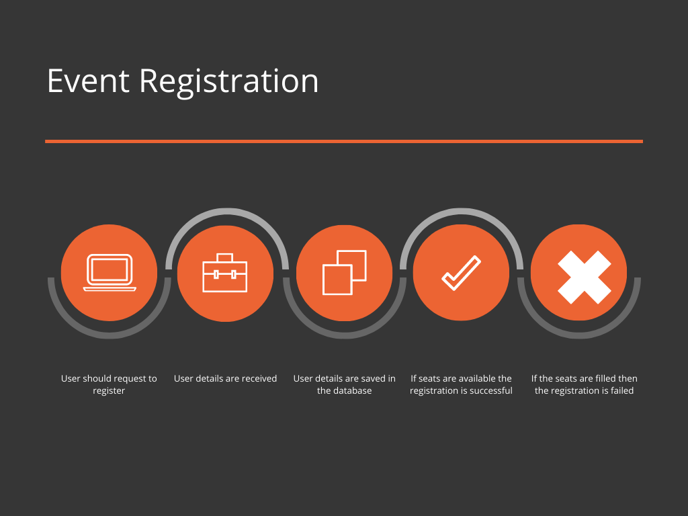
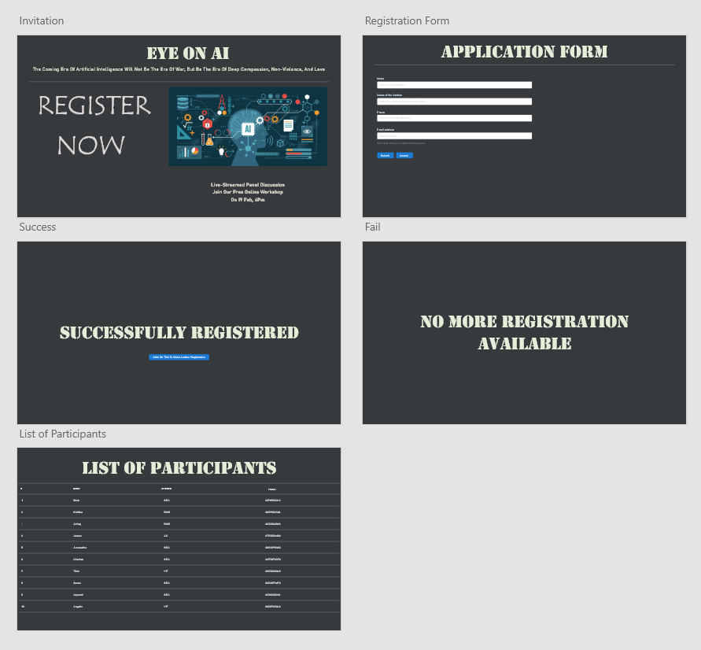
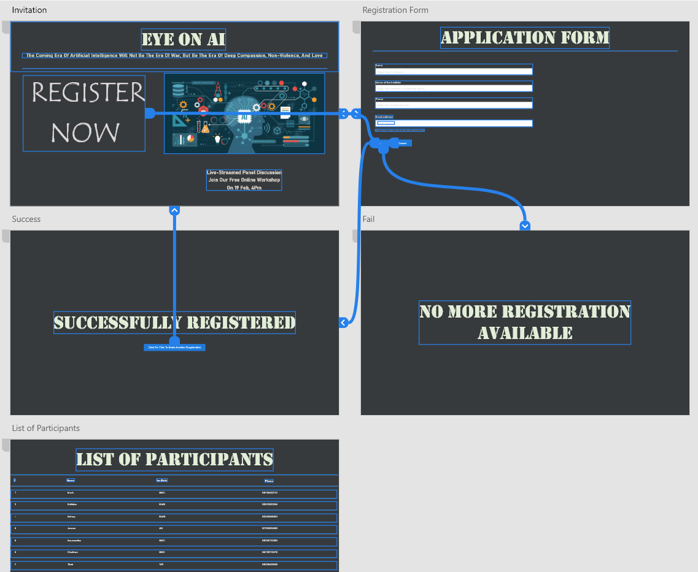
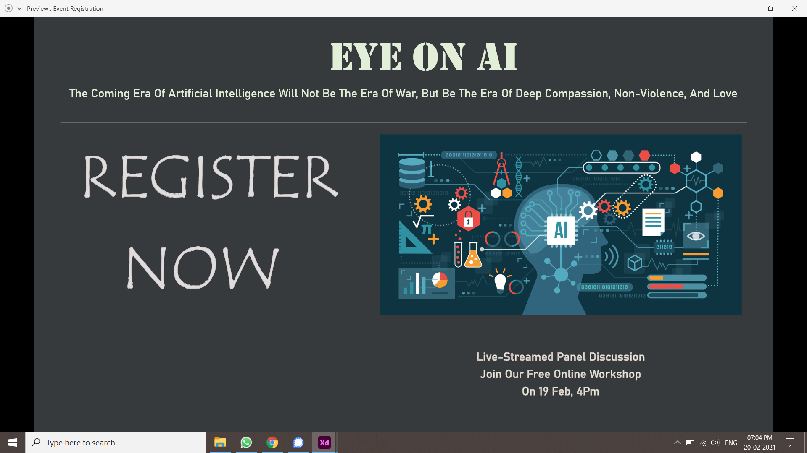
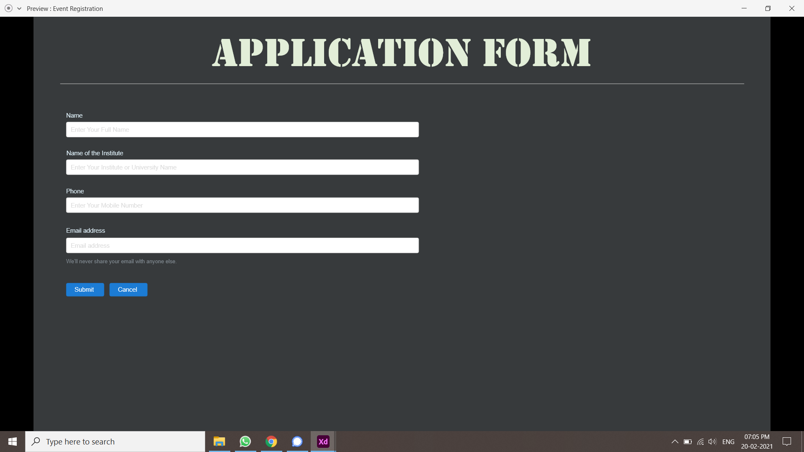
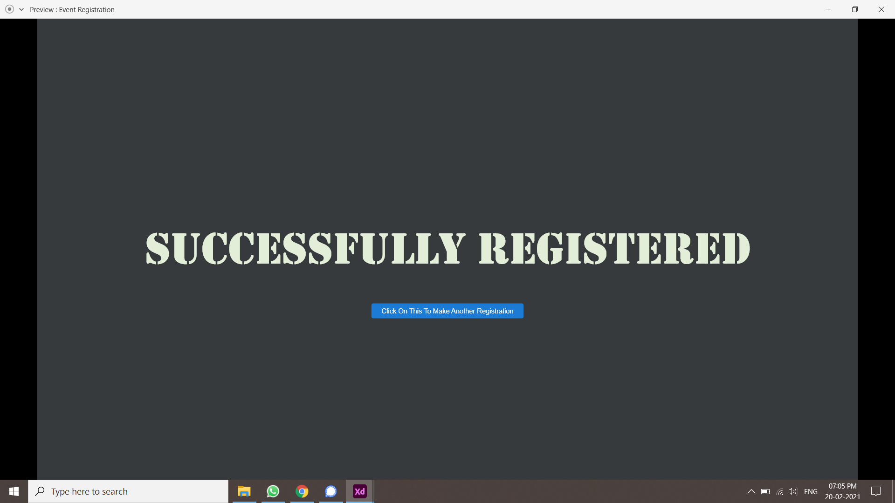
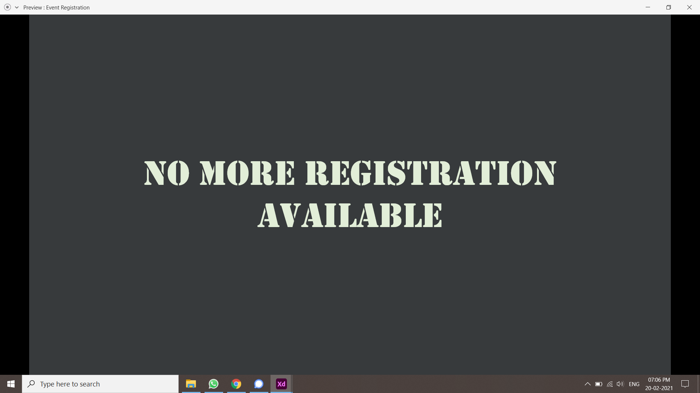
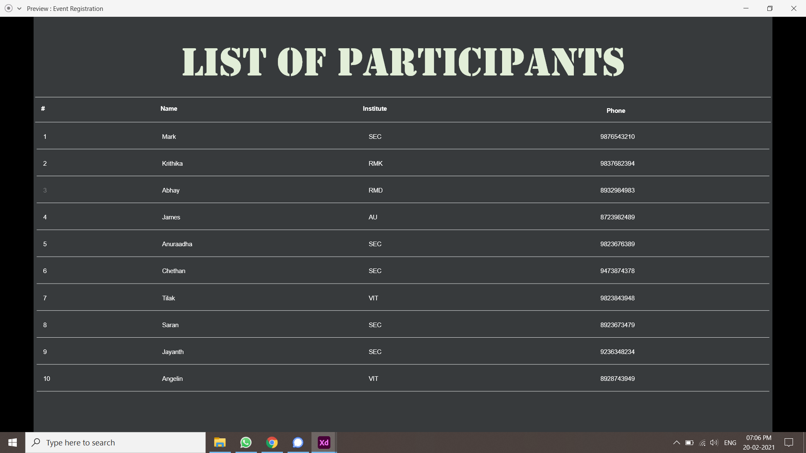
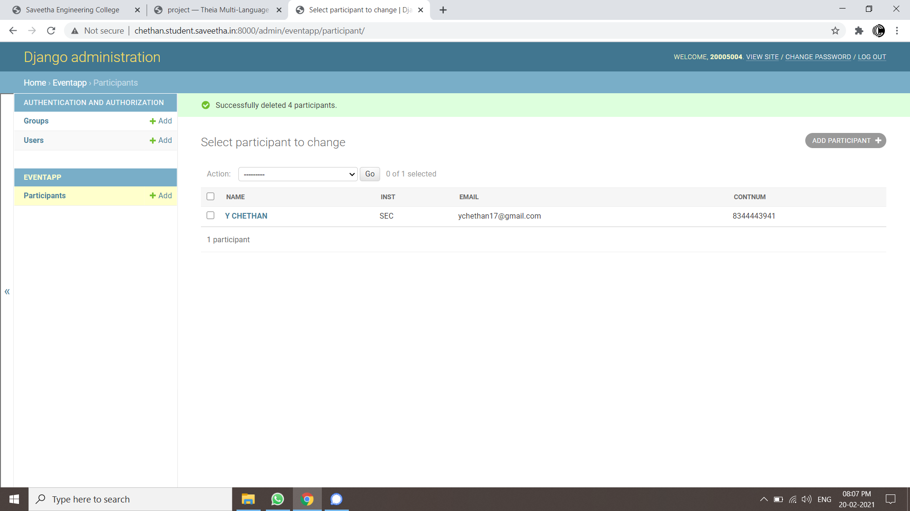

# WebApplication for Event Registration

## AIM:
To create a UX design and develop a web application for event registration.
## DESIGN STEPS:


## DESIGN SCREENS:


## WIREFRAME:


## PROTOTYPE:





## PROGRAM:
### invitation.html
```
<!doctype html>
<html lang="en">

<head>
    <!-- Required meta tags -->
    <meta charset="utf-8">
    <meta name="viewport" content="width=device-width, initial-scale=1, shrink-to-fit=no">

    <!-- Bootstrap CSS -->
    <link rel="stylesheet" href="https://maxcdn.bootstrapcdn.com/bootstrap/4.0.0/css/bootstrap.min.css"
        integrity="sha384-Gn5384xqQ1aoWXA+058RXPxPg6fy4IWvTNh0E263XmFcJlSAwiGgFAW/dAiS6JXm" crossorigin="anonymous">

    <title>EVENT INVITATION</title>
</head>

<body>
    <div class="jumbotron">
        <div class="text-center">
            <h1 class="display-8">EYES ON AI</h1>
            <div>The Coming Era Of Artificial Intelligence Will Not Be The Era Of War, But Be The Era Of Deep Compassion,
                Non-Violence, And Love
            </div>
        </div>
    </div>
    <div class="p-5 text-center bg-image" style="
      background-image: url('https://singularityhub.com/wp-content/uploads/2019/02/Ai-startups-tech-Peter-Rejceck-shutterstock-1290615073-1068x601.jpg');
      height: 600px;background-repeat: no-repeat;background-size: cover;">
        <div class="text-right">
            <div class="text-white">
                <h1 class="mb-3">Live-Streamed Panel Discussion</h1>
                <h4 class="mb-3">Join Our Free Online Workshop,</h4>
                <h4 class="mb-3">On 19 Feb, 4pm</h4>
                <a href="/register/" class="btn btn-outline-light btn-lg" role="button">Register Now</a>
            </div>
        </div>
    </div>
    <!-- Background image -->
    <script src="https://code.jquery.com/jquery-3.2.1.slim.min.js"
        integrity="sha384-KJ3o2DKtIkvYIK3UENzmM7KCkRr/rE9/Qpg6aAZGJwFDMVNA/GpGFF93hXpG5KkN" crossorigin="anonymous">
        </script>
    <script src="https://cdnjs.cloudflare.com/ajax/libs/popper.js/1.12.9/umd/popper.min.js"
        integrity="sha384-ApNbgh9B+Y1QKtv3Rn7W3mgPxhU9K/ScQsAP7hUibX39j7fakFPskvXusvfa0b4Q" crossorigin="anonymous">
        </script>
    <script src="https://maxcdn.bootstrapcdn.com/bootstrap/4.0.0/js/bootstrap.min.js"
        integrity="sha384-JZR6Spejh4U02d8jOt6vLEHfe/JQGiRRSQQxSfFWpi1MquVdAyjUar5+76PVCmYl" crossorigin="anonymous">
        </script>
</body>

</html>
```
### registration.html
```
<!doctype html>
<html lang="en">

<head>
    <!-- Required meta tags -->
    <meta charset="utf-8">
    <meta name="viewport" content="width=device-width, initial-scale=1, shrink-to-fit=no">

    <!-- Bootstrap CSS -->
    <link rel="stylesheet" href="https://maxcdn.bootstrapcdn.com/bootstrap/4.0.0/css/bootstrap.min.css"
        integrity="sha384-Gn5384xqQ1aoWXA+058RXPxPg6fy4IWvTNh0E263XmFcJlSAwiGgFAW/dAiS6JXm" crossorigin="anonymous">

    <title>Registration Form</title>
</head>

<body>
    <div class="jumbotron jumbotron-fluid">
        <div class="container text-center">
            <h1 class="display-8">EYES ON AI</h1>
            <div>The Coming Era Of Artificial Intelligence Will Not Be The Era Of War, But Be The Era Of Deep
                Compassion,
                Non-Violence, And Love
            </div>
        </div>
    </div>
    <div class="container ">
        <div class="col-12 ">
            <form action="" method="POST">
                
                <div class="form-group">
                    <label for="name">Name</label>
                    <input type="text" class="form-control" id="username" placeholder="Enter your Name" name="username" required>
                </div>
                <div class="form-group">
                    <label for="institute">Name of Your College/University</label>
                    <input type="text" class="form-control" id="institute" name="institute" placeholder="Enter the Name of the Institute" required>
                </div>

                <div class="form-group">
                    <label for="emailid">Email Address</label>
                    <input type="email" class="form-control" id="emailid" name="emailid" placeholder="Enter email" required>
                    <small id="emailHelp" class="form-text text-muted">We'll never share your email with anyone else.</small>
                </div>
                <div class="form-group">
                    <label for="number">Phone</label>
                    <input type="text" class="form-control" id="phnumber" name="phnumber" placeholder="Contact Number" required>
                </div>
                <button type="submit" class="btn btn-primary">Submit</button>
                <a href="/invite/" class="btn btn-primary" role="button">Cancel</a>
            </form>
        </div>
    </div>

    <script src="https://code.jquery.com/jquery-3.2.1.slim.min.js"
        integrity="sha384-KJ3o2DKtIkvYIK3UENzmM7KCkRr/rE9/Qpg6aAZGJwFDMVNA/GpGFF93hXpG5KkN"
        crossorigin="anonymous"></script>
    <script src="https://cdnjs.cloudflare.com/ajax/libs/popper.js/1.12.9/umd/popper.min.js"
        integrity="sha384-ApNbgh9B+Y1QKtv3Rn7W3mgPxhU9K/ScQsAP7hUibX39j7fakFPskvXusvfa0b4Q"
        crossorigin="anonymous"></script>
    <script src="https://maxcdn.bootstrapcdn.com/bootstrap/4.0.0/js/bootstrap.min.js"
        integrity="sha384-JZR6Spejh4U02d8jOt6vLEHfe/JQGiRRSQQxSfFWpi1MquVdAyjUar5+76PVCmYl"
        crossorigin="anonymous"></script>
</body>

</html>
```
### success.html
```
<!doctype html>
<html lang="en">
 
<head>
    <!-- Required meta tags -->
    <meta charset="utf-8">
    <meta name="viewport" content="width=device-width, initial-scale=1, shrink-to-fit=no">

    <!-- Bootstrap CSS -->
    <link rel="stylesheet" href="https://maxcdn.bootstrapcdn.com/bootstrap/4.0.0/css/bootstrap.min.css"
        integrity="sha384-Gn5384xqQ1aoWXA+058RXPxPg6fy4IWvTNh0E263XmFcJlSAwiGgFAW/dAiS6JXm" crossorigin="anonymous">

    <title>Success</title>
</head>

<body>
    <div class="jumbotron jumbotron-fluid">
        <div class="container text-center">
            <h1 class="display-8" >EYE ON AI</h1>
        </div>
    </div>
    <div class="container text-center ">
            <h1 >Successfully Registered!</h1>
            <h4>Link for the Workshop will be Sent to Your Registered Mail and Number.</h4>
        <a href="/invite/" class="btn btn-primary" role="button">Click On This To Make Another Registration</a>

    </div>

    <script src="https://code.jquery.com/jquery-3.2.1.slim.min.js"
        integrity="sha384-KJ3o2DKtIkvYIK3UENzmM7KCkRr/rE9/Qpg6aAZGJwFDMVNA/GpGFF93hXpG5KkN"
        crossorigin="anonymous"></script>
    <script src="https://cdnjs.cloudflare.com/ajax/libs/popper.js/1.12.9/umd/popper.min.js"
        integrity="sha384-ApNbgh9B+Y1QKtv3Rn7W3mgPxhU9K/ScQsAP7hUibX39j7fakFPskvXusvfa0b4Q"
        crossorigin="anonymous"></script>
    <script src="https://maxcdn.bootstrapcdn.com/bootstrap/4.0.0/js/bootstrap.min.js"
        integrity="sha384-JZR6Spejh4U02d8jOt6vLEHfe/JQGiRRSQQxSfFWpi1MquVdAyjUar5+76PVCmYl"
        crossorigin="anonymous"></script>
</body>

</html>
```
### failed.html
```
<!doctype html>
<html lang="en">
 
<head>
    <!-- Required meta tags -->
    <meta charset="utf-8">
    <meta name="viewport" content="width=device-width, initial-scale=1, shrink-to-fit=no">

    <!-- Bootstrap CSS -->
    <link rel="stylesheet" href="https://maxcdn.bootstrapcdn.com/bootstrap/4.0.0/css/bootstrap.min.css"
        integrity="sha384-Gn5384xqQ1aoWXA+058RXPxPg6fy4IWvTNh0E263XmFcJlSAwiGgFAW/dAiS6JXm" crossorigin="anonymous">

    <title>Failed</title>
</head>

<body>
    <div class="jumbotron jumbotron-fluid">
        <div class="container text-center">
            <h1 class="display-8">EYE ON AI</h1>
        </div>
    </div>
    <div class="container text-center ">
        <h1 >Oops! Better Luck Next Time, No More Registration Available</h1>
    </div>

    <script src="https://code.jquery.com/jquery-3.2.1.slim.min.js"
        integrity="sha384-KJ3o2DKtIkvYIK3UENzmM7KCkRr/rE9/Qpg6aAZGJwFDMVNA/GpGFF93hXpG5KkN"
        crossorigin="anonymous"></script>
    <script src="https://cdnjs.cloudflare.com/ajax/libs/popper.js/1.12.9/umd/popper.min.js"
        integrity="sha384-ApNbgh9B+Y1QKtv3Rn7W3mgPxhU9K/ScQsAP7hUibX39j7fakFPskvXusvfa0b4Q"
        crossorigin="anonymous"></script>
    <script src="https://maxcdn.bootstrapcdn.com/bootstrap/4.0.0/js/bootstrap.min.js"
        integrity="sha384-JZR6Spejh4U02d8jOt6vLEHfe/JQGiRRSQQxSfFWpi1MquVdAyjUar5+76PVCmYl"
        crossorigin="anonymous"></script>
</body>

</html>
```
### listofparticipants.html
```
<!doctype html>
<html lang="en">

<head>
    <!-- Required meta tags -->
    <meta charset="utf-8">
    <meta name="viewport" content="width=device-width, initial-scale=1, shrink-to-fit=no">

    <!-- Bootstrap CSS -->
    <link rel="stylesheet" href="https://maxcdn.bootstrapcdn.com/bootstrap/4.0.0/css/bootstrap.min.css"
        integrity="sha384-Gn5384xqQ1aoWXA+058RXPxPg6fy4IWvTNh0E263XmFcJlSAwiGgFAW/dAiS6JXm" crossorigin="anonymous">

    <title>List of Participants</title>
</head>

<body>
    <div class="jumbotron jumbotron-fluid">
        <div class="container text-center">
            <h1 class="display-8">EYE ON AI</h1>
        </div>
    </div>
    <div class="container">
        <h1>LIST OF PARTICIPANTS</h1>
        <table class="table  table-striped table-dark">
            <thead>
                <tr>
                    <th scope="col">Name</th>
                    <th scope="col">Email</th>
                    <th scope="col">Contact number</th>
                    <th scope="col">Institute</th>

                </tr>
            </thead>
            <tbody>
                

                <tr >
                    <td> {{col.name}}</td>
                    <td>{{col.inst}}</td>
                    <td>{{col.email}}</td>
                    <td>{{col.contnum}}</td>

                </tr>
                


            </tbody>
        </table>
    </div>

    <!-- Optional JavaScript -->
    <!-- jQuery first, then Popper.js, then Bootstrap JS -->
    <script src="https://code.jquery.com/jquery-3.2.1.slim.min.js"
        integrity="sha384-KJ3o2DKtIkvYIK3UENzmM7KCkRr/rE9/Qpg6aAZGJwFDMVNA/GpGFF93hXpG5KkN"
        crossorigin="anonymous"></script>
    <script src="https://cdnjs.cloudflare.com/ajax/libs/popper.js/1.12.9/umd/popper.min.js"
        integrity="sha384-ApNbgh9B+Y1QKtv3Rn7W3mgPxhU9K/ScQsAP7hUibX39j7fakFPskvXusvfa0b4Q"
        crossorigin="anonymous"></script>
    <script src="https://maxcdn.bootstrapcdn.com/bootstrap/4.0.0/js/bootstrap.min.js"
        integrity="sha384-JZR6Spejh4U02d8jOt6vLEHfe/JQGiRRSQQxSfFWpi1MquVdAyjUar5+76PVCmYl"
        crossorigin="anonymous"></script>
</body>

</html>
```
### models.py
```
from django.db import models
from django.contrib import admin
# Create your models here.

class Participant(models.Model):
    name=models.CharField(max_length=20)
    inst=models.CharField(max_length=20)
    email=models.CharField(max_length=40)
    contnum=models.CharField(max_length=15)

class ParticipantAdmin(admin.ModelAdmin):
    list_display=("name","inst","email","contnum")
```
### views.py
```
from django.shortcuts import render
from .models import Participant, ParticipantAdmin
# Create your views here.
def invitation(request):
    context={}
    return render(request,"eventapp/invitation.html",context)

def registration(request):
    context={}
    if request.method == 'POST':
        p1 = Participant()
        p1.name = request.POST.get('username','-')
        p1.inst = request.POST.get('institute','-')
        p1.email = request.POST.get('emailid','-')
        p1.contnum = request.POST.get('phnumber','000')

        if len(Participant.objects.all()) > 10:
            return render(request, 'eventapp/failed.html',context)
        else:
            p1.save()
            return render(request, 'eventapp/success.html',context)

    if request.method == 'GET':
        context['name'] = ''
        context['inst'] = ''
        context['email'] = ''
        context['contnum'] = ''

    return render(request,"eventapp/registration.html",context)
    
def listofparticipants(request):
    context={}
    context['participants'] = Participant.objects.all()
    return render(request,"eventapp/listofparticipants.html",context)
```
## OUTPUT:
.png)
.png)
.png)
.png)

## RESULT:
Thus a UX design is created and a web application is developed for event registration and is hosted in the URL http://chethan.student.saveetha.in:8000/invite.